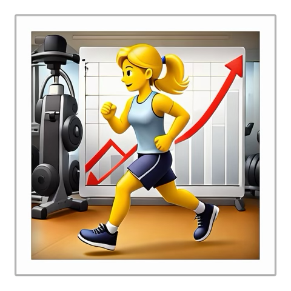

# 
  
<h1>

RecFlow App
</h1>

A simple easy to use tracking system that analyzes foot traffic for you! Say goodbye to the days of manually inputing data into spreadsheets and creating indivudual graphs for presentations. 

 <i> RecFlow does all the heavy lifting,
  so you can get back to what matters most.</i>

   > Get started, view data, track trends, and do more. 

   > Improving fitness centers since 2026.  

 

## Getting Started

1. Toggle between the **Turlock** and **Stockton** campus using the drop down menu on the right.
   > Click on **Quick Log** to instantly log an individual walk in.

3. Use **Log a specific entry:** to log multiple entires at once.
   > This allows you log numerous walk-ins at once with ease.
   
   > Simply select the **location, date, time, and how many indivuduals** entered the facility and click **Log Entry** on the bottom right.

## View Data Analysis

1. Click on the **Fusion Innosoft Analytics** tab to view developing trends on your facilities foot traffic.

   > View side by side comparisons between your fitness facilities.
   
   > Discover foot traffic trends to adjust your operating hours.

   > Determine which locations are thriving to improve your other locations.
   
   > Make adjustments to your programming based on accurate data findings.

2. Click on the **Data** tab to view detailed logs and data entries.

   > Download data using the **Download Data CSV** button. 

   > Scroll through processed detailed logs under the **Fusion Innosoft Raw Data** to view which members are using your facility and how often.

## Uploading Your Own Data

1. Upload your data using **Import Historical Check-ins** to find trends from previous semesters. For example:
   > Upload raw data from software like "Fusion Innsoft" or other data tracking systems.
   
   > Turn those dull spreadsheets into meaninful data analytics by simplying uploading them onto the RecFlow App.
2. Select **Upload...**
3. Choose your file

CSV files will automatically open as a table when you click them.

---

<i>
Don't just track the movement –– command the flow. 
 
Stop guessing. Start Flowing. 🚀

</i>
